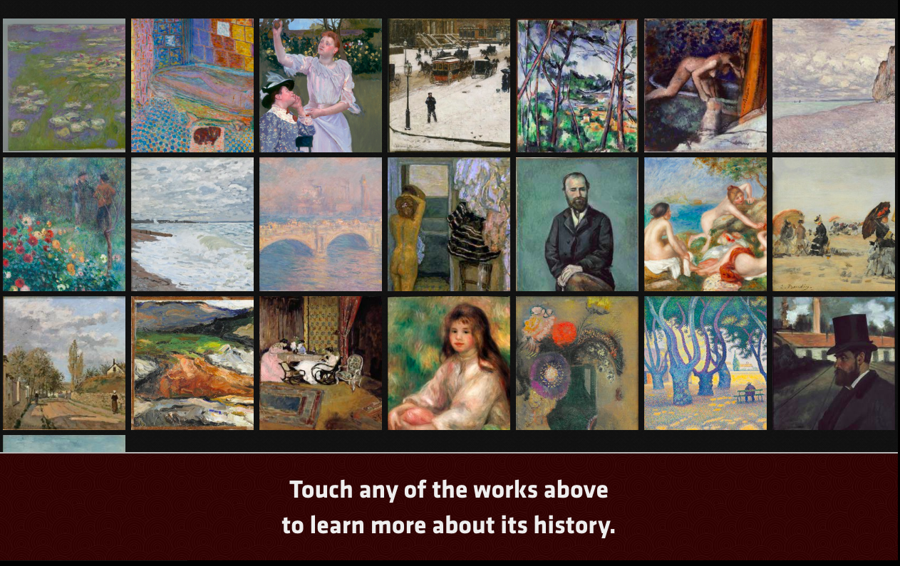
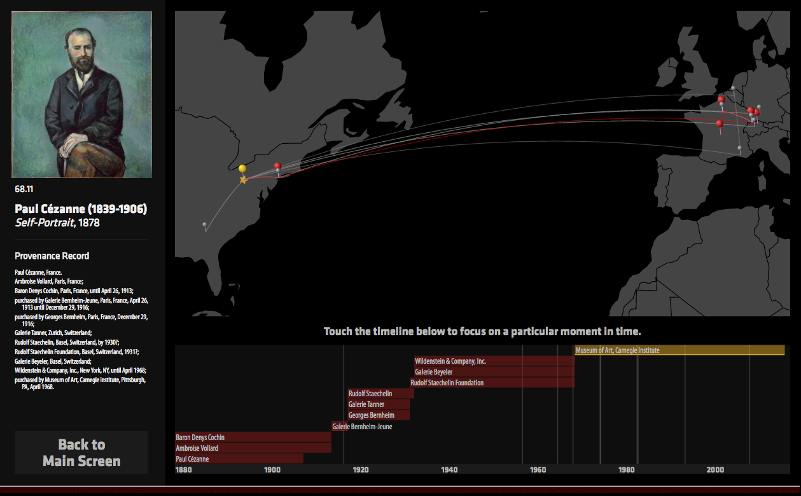

This software is the Alpha prototype of a gallery interactive created by the Art Tracks team at the [Carnegie Museum of Art](http://www.cmoa.org) in early 2015.  It was designed to run on a touchscreen located inside of our Impressionist Gallery. 

If you're interested in seeing a working version of this interactive, please visit <http://arttracks.github.io/provenance-interactive/>.

This project was generously funded by the [Institute for Museum and Library Services](http://imls.gov) as part of the [Art Tracks](http://www.museumprovenance.org) project.


## Main Screen



The creatively named "Provenance Interactive" visualizes the movement of works of art across space and time.  It is designed to be installed with the actual works of art surrounding the object, so it does not emphasize images of the actual works themselves.

The interactive by default shows a grid of available artwork.  Touching any of these artworks will bring up a detail visualization of that work.  After a fixed duration, the interactive will reset to this screen.

Because the interactive was designed to work with a touchscreen, by default the mouse cursor is invisible.  

**Press the `X` key to toggle the cursor's visibility at any time.**  

## Detail Screen



Each detail screen shows the provenance text of the object, along with a visualization that shows the ownership history and location history of the object visualized in space and time.  Each colored bar indicates the a possible period of ownership by that individual, and the white lines indicate exhibitions in the work's history.  By touching the timeline, an user can choose to focus the visualization on a specific moment in history, showing where the work might have been located at that time.  Dragging along the timeline will visualize the movement of the work through time and space.

*(This interactive was designed to work on a screen with a fixed resolution using the Chrome browser.  It has not been tested in other browsers, and it does not adjust to different resolutions.  Needless to say, it's also not mobile-friendly.)*


## Technical Details

This application is written as a static HTML application generated using [Middleman](https://middlemanapp.com).  Middleman is a Ruby library for generating static websites, and is in general a wonderful tool for projects like this.  This means that there is no need for a server beyond a simple HTML server, and there is no back end for the system—everything is pre-compiled.

We are using Github Pages to serve the content.  To publish the pages, we're using the [middleman-gh-pages](https://github.com/edgecase/middleman-gh-pages) library, which gives us a single command, `rake publish`, to compile our assets and deploy them to the server.

The visualization itself is written using [D3.js](https://d3js.org/), a fabulous data visualization library.  

We're also using [moment.js](http://momentjs.com/) to help with date parsing, along with a [small custom library](https://github.com/cmoa/provenance-interactive/blob/master/source/javascripts/_julian.js) to convert Julian Days into Moment.js UTC dates.  

We also use the [BigText](https://github.com/zachleat/bigtext) library to help dynamically scale the text to fit the available space.

We're also using the [Middleman Simple Thumbnailer](https://github.com/kubenstein/middleman-simple-thumbnailer) extension to generate the thumbnails for the grid layout.

The actual data for the project is contained within a [JSON file](https://github.com/cmoa/provenance-interactive/blob/master/source/data/collection.json) that is generated from structured provenance information generated with the [museum provenance](https://github.com/arttracks/museum_provenance) library.  The actual data-munging script for this is not provided: unfortunately it relies on internal libraries and wouldn't be useful outside of CMOA.

## To install and run the application:

These instructions for installing the project assume that you have a ruby interpreter on your computer, and that you have installed [`bundler`](http://bundler.io).  

To install the application, enter the following into a terminal:

    git clone git@github.com:cmoa/provenance-interactive.git
    cd provenance-interactive
    bundle install
    bundle exec middleman

And then open <http://localhost:4567/> in a web browser.

## How to update the gallery interactive data:

*(Note that these instructions require you to work at the Carnegie Museum of Art and aren't  useful for anyone else. They detail internal steps needed to reprocess the data and extract the images from our internal servers and they reference internal libraries and code.  Also, as an aside to future me, they're somewhat out of date, since they use v.0.1 of the museum_provenance libraries and were written before the Archives project gave us better image access libraries.)*


1). Get an export  
2). Convert the export to json  

```
cmoa
cd art_tracks_utilities
arttracks convert <XML_FILE> --intranet
# once for each of the three exports
```

3). copy the data files into the provenance_reporter directory  
4). run the provenance reporter

```
cmoa
cd provenance-reporter
bundle exec ruby test.rb

```

5). run the images script

```
bundle exec ruby images.rb
# note that you must be on CMOA internal network, and not connected to WIFI
```

6). copy the images in the gallery8 directory to `gallery_interactive`

```
cmoa
cd gallery_interactive
middleman server
# verify that it worked, then ^c to exit the middleman server
git add .
git commit -m "this is my message"
rake build
rake publish
```
